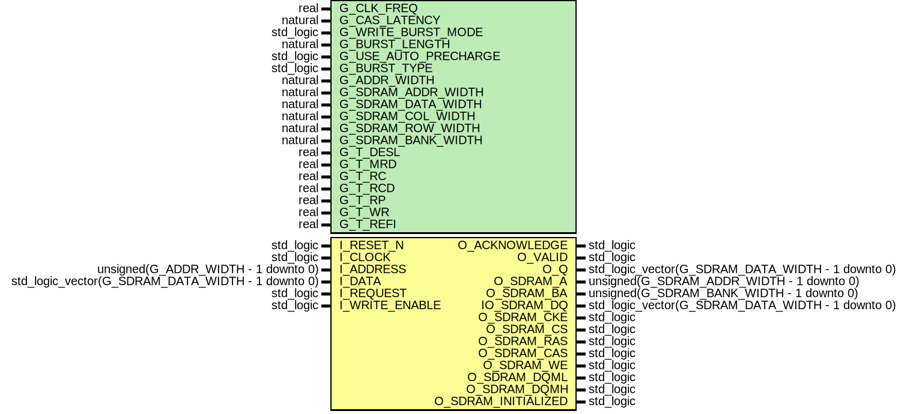

# Entity: SDRAM_CONTROLLER 
- **File**: SDRAM_Controller.vhd

## Diagram

## Description

This controller is able to work with any burst length and any mode supported by the target SDRAM.
Currently burst termination is not supported! If it's configured to run in 8 burst mode, you have
to supply 8 words of data or read 8 words. If you have dynamically changing burst lengths,
configure it to run in single mode or bursts of 1.
You'll have to set most of the generics according to your target SDRAM. Please take a look at the hardware docs.

## Generics

| Generic name         | Type      | Value | Description                                                                                                              |
| -------------------- | --------- | ----- | ------------------------------------------------------------------------------------------------------------------------ |
| G_CLK_FREQ           | real      | 96.0  | Frequency with which the SDRAM is operated. Used to calculate the delay counters.                                        |
| G_CAS_LATENCY        | natural   | 2     | Delay in clock cycles between a read command and the output of valid data.                                               |
| G_WRITE_BURST_MODE   | std_logic | '0'   | Decides if the sdram is run in burst or single access mode.                                                              |
| G_BURST_LENGTH       | natural   | 8     | If sdram is used in burst mode, this value sets the burst length. Otherwise it gets overridden to 1.                     |
| G_USE_AUTO_PRECHARGE | std_logic | '0'   | Decides if the controller uses the auto precharge function. Auto precharge can cause unnecessary delays!                 |
| G_BURST_TYPE         | std_logic | '0'   | The ordering of the accesses within a burst                                                                              |
| G_ADDR_WIDTH         | natural   |       | Address width of the controller. Sum of row, col and bank width.                                                         |
| G_SDRAM_ADDR_WIDTH   | natural   |       | Width of the sdram address register. Either row- or column register size, whichever is larger.                           |
| G_SDRAM_DATA_WIDTH   | natural   |       | Width of the sdram data input.                                                                                           |
| G_SDRAM_COL_WIDTH    | natural   |       | Width of the sdram column input.                                                                                         |
| G_SDRAM_ROW_WIDTH    | natural   |       | Width of the sdram row input.                                                                                            |
| G_SDRAM_BANK_WIDTH   | natural   |       | Width of the sdram bank input.                                                                                           |
| G_T_DESL             | real      |       | **Startup delay** - Time until the initilization cycle may begin after power up in ns.                                   |
| G_T_MRD              | real      |       | **Mode register programm time** - Time needed to program the mode register at init in ns.                                |
| G_T_RC               | real      |       | **row cycle time** - Time to wait between two active commands, two refresh commands or between refresh and active in ns. |
| G_T_RCD              | real      |       | **RAS to CAS delay** - Time to wait between an active and a subsequent write/read command in ns.                         |
| G_T_RP               | real      |       | **Precharge to active delay** - Time to wait after a precharge command in ns.                                            |
| G_T_WR               | real      |       | **Write recovery time** - Sometimes called t_dpl. Time to wait until precharge after the last write command in ns.       |
| G_T_REFI             | real      |       | **Refresh cycle time** - Time until the sdram needs a refresh in ns.                                                     |

## Ports

| Port name           | Direction | Type                                              | Description                                                                                        |
| ------------------- | --------- | ------------------------------------------------- | -------------------------------------------------------------------------------------------------- |
| I_RESET_N           | in        | std_logic                                         | Low-active async reset input.                                                                      |
| I_CLOCK             | in        | std_logic                                         | clock                                                                                              |
| I_ADDRESS           | in        | unsigned(G_ADDR_WIDTH - 1 downto 0)               | **address bus** - Target for the next read or write command.                                       |
| I_DATA              | in        | std_logic_vector(G_SDRAM_DATA_WIDTH - 1 downto 0) | **input data bus** - Data for the next write cycle. Not relevant if next cmd is a read.            |
| I_REQUEST           | in        | std_logic                                         | When the request signal is asserted, an operation will be performed.                               |
| I_WRITE_ENABLE      | in        | std_logic                                         | When request is asserted, this signal decides if the next command is a read or write.              |
| O_ACKNOWLEDGE       | out       | std_logic                                         | When acknowledge is asserted, the next address (and if it's a write the next data) was registered. |
| O_VALID             | out       | std_logic                                         | The valid signal is asserted when there is a valid word at the output                              |
| O_Q                 | out       | std_logic_vector(G_SDRAM_DATA_WIDTH - 1 downto 0) | output data bus                                                                                    |
| O_SDRAM_A           | out       | unsigned(G_SDRAM_ADDR_WIDTH - 1 downto 0)         | Address bus connected to the sdram.                                                                |
| O_SDRAM_BA          | out       | unsigned(G_SDRAM_BANK_WIDTH - 1 downto 0)         | bank bus connected to the sdram.                                                                   |
| IO_SDRAM_DQ         | inout     | std_logic_vector(G_SDRAM_DATA_WIDTH - 1 downto 0) | Data bus connected to the sdram.                                                                   |
| O_SDRAM_CKE         | out       | std_logic                                         | Clock enable signal connected to the sdram.                                                        |
| O_SDRAM_CS          | out       | std_logic                                         | Chip select signal connected to the sdram.                                                         |
| O_SDRAM_RAS         | out       | std_logic                                         | Row address strobe signal connected to the sdram.                                                  |
| O_SDRAM_CAS         | out       | std_logic                                         | Column address strobe signal connected to the sdram.                                               |
| O_SDRAM_WE          | out       | std_logic                                         | Write enable signal connected to the sdram.                                                        |
| O_SDRAM_DQML        | out       | std_logic                                         | dqml signal connected to the sdram.                                                                |
| O_SDRAM_DQMH        | out       | std_logic                                         | dqmh signal connected to the sdram.                                                                |
| O_SDRAM_INITIALIZED | out       | std_logic                                         | indicates if the initilization process is done.                                                    |

## Signals

| Name                         | Type                                              | Description                                                                                                               |
| ---------------------------- | ------------------------------------------------- | ------------------------------------------------------------------------------------------------------------------------- |
| w_load_mode_done             | std_logic                                         | Indicates if the needed number of cycles after issuing the load mode cmd is over.                                         |
| w_active_done                | std_logic                                         | Indicates if the needed number of cycles after issuing the active cmd is over.                                            |
| w_refresh_done               | std_logic                                         | Indicates if the needed number of cycles after issuing the refresh cmd is over.                                           |
| w_read_done                  | std_logic                                         | Indicates if the current read burst is over. If auto precharge is on it indicates that the next active cmd can be issued. |
| w_write_done                 | std_logic                                         | Indicates if the current write burst is over. It also indicates that the next active cmd can be issued.                   |
| w_write_done_no_ap           | std_logic                                         | Indicates if the current write burst is over.                                                                             |
| w_write_recovery_done        | std_logic                                         | Indicates if the needed number of cycles after issuing the last write command is over.                                    |
| w_precharge_done             | std_logic                                         | Indicates if the needed number of cycles after issuing the precharge cmd is over.                                         |
| w_should_refresh             | std_logic                                         | Indicates if the number of cycles until the next refresh is needed is over.                                               |
| w_next_address               | unsigned(G_SDRAM_ADDR_WIDTH - 1 downto 0)         | Next address to load into the register based on the current state and input address.                                      |
| w_next_bank                  | unsigned(G_SDRAM_BANK_WIDTH - 1 downto 0)         | Next bank to load into the register based on the current state and input address.                                         |
| w_next_data                  | std_logic_vector(G_SDRAM_DATA_WIDTH - 1 downto 0) | Next data to load into the register based on the current state and input data.                                            |
| w_next_ack                   | std_logic                                         | Next valid indicator to load into the flip flop based on the current valid shifter state.                                 |
| w_next_and_current_row_equal | std_logic                                         | Indicates if the currently opened row is the same as the row of the next requested address.                               |
| w_next_cmd                   | t_command                                         | Next command to issue based on the current state and inputs.                                                              |
| w_col                        | unsigned(G_SDRAM_ADDR_WIDTH - 1 downto 0)         | Decoded column based on the currently pending address.                                                                    |
| w_row                        | unsigned(G_SDRAM_ROW_WIDTH - 1 downto 0)          | Decoded row based on the currently pending address.                                                                       |
| w_bank                       | unsigned(G_SDRAM_BANK_WIDTH - 1 downto 0)         | Decoded bank based on the currently pending address.                                                                      |
| w_next_state                 | t_state                                           | Next pending state                                                                                                        |
| r_state                      | t_state                                           | Current state.                                                                                                            |
| r_cmd                        | t_command                                         | Currently running command.                                                                                                |
| r_wait_counter               | natural range 0 to c_init_wait + 100              | Stores the number of cycles since the last state change.                                                                  |
| r_refresh_counter            | natural range 0 to c_refresh_interval + 100       | Stores the number of cycles since the last refresh.                                                                       |
| r_pending_data_count_dq      | natural range 0 to 20                             | Stores the number of output data in the current burst.                                                                    |
| r_pending_burst_count        | natural range 0 to 20                             | Stores the number of burst left .                                                                                         |
| r_recent_row                 | unsigned(G_SDRAM_ROW_WIDTH - 1 downto 0)          | Stores the last loaded row.                                                                                               |
| r_valid_shift                | std_logic_vector(G_CAS_LATENCY downto 0)          | Stores the state of the valid shift register.                                                                             |
| r_address                    | unsigned(G_SDRAM_ADDR_WIDTH - 1 downto 0)         | Stores the currently loaded address that will be forwarded to the sdram.                                                  |
| r_bank                       | unsigned(G_SDRAM_BANK_WIDTH - 1 downto 0)         | Stores the currently loaded addbankress that will be forwarded to the sdram.                                              |
| r_dq                         | std_logic_vector(G_SDRAM_DATA_WIDTH - 1 downto 0) | Stores the data that will be forwarded to the sdram.                                                                      |
| r_q                          | std_logic_vector(G_SDRAM_DATA_WIDTH - 1 downto 0) | Stores the data that will be forwarded to the data output.                                                                |
| r_valid                      | std_logic                                         | Stores the valid state that will be forwarded to o_valid.                                                                 |
| r_cke                        | std_logic                                         | Stores the current state of the clock enable signal that will be forwarded to the sdram.                                  |

## Constants

| Name                      | Type                                                          | Value                                                                                                                                                                                                                                                                                                                                                                                                                                                                                                                                                                                                                                                                                                                                                                                                                                                                     | Description                                                                                                                 |
| ------------------------- | ------------------------------------------------------------- | ------------------------------------------------------------------------------------------------------------------------------------------------------------------------------------------------------------------------------------------------------------------------------------------------------------------------------------------------------------------------------------------------------------------------------------------------------------------------------------------------------------------------------------------------------------------------------------------------------------------------------------------------------------------------------------------------------------------------------------------------------------------------------------------------------------------------------------------------------------------------- | --------------------------------------------------------------------------------------------------------------------------- |
| c_cmd_deselect            | t_command                                                     | "1---"                                                                                                                                                                                                                                                                                                                                                                                                                                                                                                                                                                                                                                                                                                                                                                                                                                                                    | Combination of chip select, row address strobe, column address strobe and write enable to initiate a deselect command.      |
| c_cmd_load_mode           | t_command                                                     | "0000"                                                                                                                                                                                                                                                                                                                                                                                                                                                                                                                                                                                                                                                                                                                                                                                                                                                                    | Combination of chip select, row address strobe, column address strobe and write enable to initiate a load mode command.     |
| c_cmd_auto_refresh        | t_command                                                     | "0001"                                                                                                                                                                                                                                                                                                                                                                                                                                                                                                                                                                                                                                                                                                                                                                                                                                                                    | Combination of chip select, row address strobe, column address strobe and write enable to initiate an auto refresh command. |
| c_cmd_precharge           | t_command                                                     | "0010"                                                                                                                                                                                                                                                                                                                                                                                                                                                                                                                                                                                                                                                                                                                                                                                                                                                                    | Combination of chip select, row address strobe, column address strobe and write enable to initiate a precharge command.     |
| c_cmd_active              | t_command                                                     | "0011"                                                                                                                                                                                                                                                                                                                                                                                                                                                                                                                                                                                                                                                                                                                                                                                                                                                                    | Combination of chip select, row address strobe, column address strobe and write enable to initiate an active command.       |
| c_cmd_write               | t_command                                                     | "0100"                                                                                                                                                                                                                                                                                                                                                                                                                                                                                                                                                                                                                                                                                                                                                                                                                                                                    | Combination of chip select, row address strobe, column address strobe and write enable to initiate a write command.         |
| c_cmd_read                | t_command                                                     | "0101"                                                                                                                                                                                                                                                                                                                                                                                                                                                                                                                                                                                                                                                                                                                                                                                                                                                                    | Combination of chip select, row address strobe, column address strobe and write enable to initiate a read command.          |
| c_cmd_stop                | t_command                                                     | "0110"                                                                                                                                                                                                                                                                                                                                                                                                                                                                                                                                                                                                                                                                                                                                                                                                                                                                    | Combination of chip select, row address strobe, column address strobe and write enable to initiate a burst stop command.    |
| c_cmd_nop                 | t_command                                                     | "0111"                                                                                                                                                                                                                                                                                                                                                                                                                                                                                                                                                                                                                                                                                                                                                                                                                                                                    | Combination of chip select, row address strobe, column address strobe and write enable to initiate a nop command.           |
| c_calculated_burst_length | natural                                                       | decide_burst_length(G_WRITE_BURST_MODE,  G_BURST_LENGTH)                                                                                                                                                                                                                                                                                                                                                                                                                                                                                                                                                                                                                                                                                                                                                                               |                                                                                                                             |
| c_mode_reg                | unsigned(G_SDRAM_ADDR_WIDTH - 1 downto 0)                     | (                                                                                         "000" &                                                                                         G_WRITE_BURST_MODE &                                                                                         "00" &                                                                                         to_unsigned(G_CAS_LATENCY,  3) &                                                                                         G_BURST_TYPE &                                                                                         to_unsigned(natural(ceil(log2(real(c_calculated_burst_length)))),  3)                                                                                       ) |                                                                                                                             |
| c_clk_period              | real                                                          | 1.0 / G_CLK_FREQ * 1000.0                                                                                                                                                                                                                                                                                                                                                                                                                                                                                                                                                                                                                                                                                                                                                                                                                                                 | Calculated clock period based on the clock frequency.                                                                       |
| c_init_wait               | natural                                                       | natural(ceil(G_T_DESL / c_clk_period))                                                                                                                                                                                                                                                                                                                                                                                                                                                                                                                                                                                                                                                                                                                                                                                                                                    | The number of clock cycles to wait before initialising the device.                                                          |
| c_load_mode_wait          | natural                                                       | natural(ceil(G_T_MRD / c_clk_period))                                                                                                                                                                                                                                                                                                                                                                                                                                                                                                                                                                                                                                                                                                                                                                                                                                     | The number of clock cycles to wait while a LOAD MODE command is being executed                                              |
| c_active_wait             | natural                                                       | natural(ceil(G_T_RCD / c_clk_period))                                                                                                                                                                                                                                                                                                                                                                                                                                                                                                                                                                                                                                                                                                                                                                                                                                     | The number of clock cycles to wait while an ACTIVE command is being executed                                                |
| c_refresh_wait            | natural                                                       | natural(ceil(G_T_RC / c_clk_period))                                                                                                                                                                                                                                                                                                                                                                                                                                                                                                                                                                                                                                                                                                                                                                                                                                      | The number of clock cycles to wait while a REFRESH command is being executed                                                |
| c_precharge_wait          | natural                                                       | natural(ceil(G_T_RP / c_clk_period))                                                                                                                                                                                                                                                                                                                                                                                                                                                                                                                                                                                                                                                                                                                                                                                                                                      | The number of clock cycles to wait while a PRECHARGE command is being executed                                              |
| c_read_wait               | natural                                                       | G_CAS_LATENCY + c_calculated_burst_length                                                                                                                                                                                                                                                                                                                                                                                                                                                                                                                                                                                                                                                                                                                                                                                                                                 | The number of clock cycles to wait while a READ command is being executed                                                   |
| c_recovery_wait           | natural                                                       | natural(ceil((G_T_WR) / c_clk_period))                                                                                                                                                                                                                                                                                                                                                                                                                                                                                                                                                                                                                                                                                                                                                                                                                                    | The number of clock cycles to wait after the last write command was issued until precharge                                  |
| c_write_wait              | natural                                                       | c_calculated_burst_length + natural(ceil((G_T_WR + G_T_RP) / c_clk_period))                                                                                                                                                                                                                                                                                                                                                                                                                                                                                                                                                                                                                                                                                                                                                                                               | The number of clock cycles to wait while a WRITE command is being executed                                                  |
| c_refresh_interval        | natural                                                       | natural(floor(G_T_REFI / c_clk_period)) - 10                                                                                                                                                                                                                                                                                                                                                                                                                                                                                                                                                                                                                                                                                                                                                                                                                              | The number of clock cycles before the memory controller needs to refresh the SDRAM                                          |
| c_a10_bitmask             | unsigned(G_SDRAM_ADDR_WIDTH - 1 downto 0)                     | (10 => G_USE_AUTO_PRECHARGE,  others => '0')                                                                                                                                                                                                                                                                                                                                                                                                                                                                                                                                                                                                                                                                                                                                                                                           | Bitmask for setting the A10 autoprecharge (or not)                                                                          |
| c_bitmask_padding         | unsigned(G_SDRAM_ADDR_WIDTH - G_SDRAM_COL_WIDTH - 1 downto 0) | (others => '0')                                                                                                                                                                                                                                                                                                                                                                                                                                                                                                                                                                                                                                                                                                                                                                                                                                                           | All zero vector to append to the column address. Needed to combine the auto precharge setting with the column.              |

## Types

| Name    | Type                                                                                                                                                                                                                                                                                                                                                                                                                           | Description                              |
| ------- | ------------------------------------------------------------------------------------------------------------------------------------------------------------------------------------------------------------------------------------------------------------------------------------------------------------------------------------------------------------------------------------------------------------------------------ | ---------------------------------------- |
| t_state | (INIT,  MODE,  IDLE,  ACTIVE,  READ,  WRITE,  REFRESH,  PRECHARGE,  WRITE_RECOVERY,  READ_RECOVERY) | Defines the states of the state machine. |

## Functions
- decide_burst_length (write_burst_mode_a : std_logic;  burst_length_a: natural) return natural

## Processes
- STATE_TRANSITION: ( r_pending_data_count_dq, w_bank, I_DATA, w_col, w_next_and_current_row_equal, r_state, r_wait_counter, I_REQUEST, w_load_mode_done, w_active_done, w_refresh_done, w_read_done, w_write_done, w_should_refresh, w_precharge_done, w_write_done_no_ap, r_recent_row, I_WRITE_ENABLE, w_write_recovery_done, w_row )
- FF_NEXT_STATE: ( I_CLOCK, I_RESET_N )
- OUTPUT_REGISTERS: ( I_CLOCK, I_RESET_N )
- FF_RECENT_ROW: ( I_CLOCK, I_RESET_N )
- UPDATE_WAIT_COUNTER: ( I_CLOCK, I_RESET_N )
- UPDATE_REFRESH_COUNTER: ( I_CLOCK, I_RESET_N )
- BURST_COUNTER: ( I_CLOCK, I_RESET_N )
- DQ_DATA_PENDING_COUNTER: ( I_CLOCK, I_RESET_N )
- VALID_SHIFTER: ( I_CLOCK, I_RESET_N )
